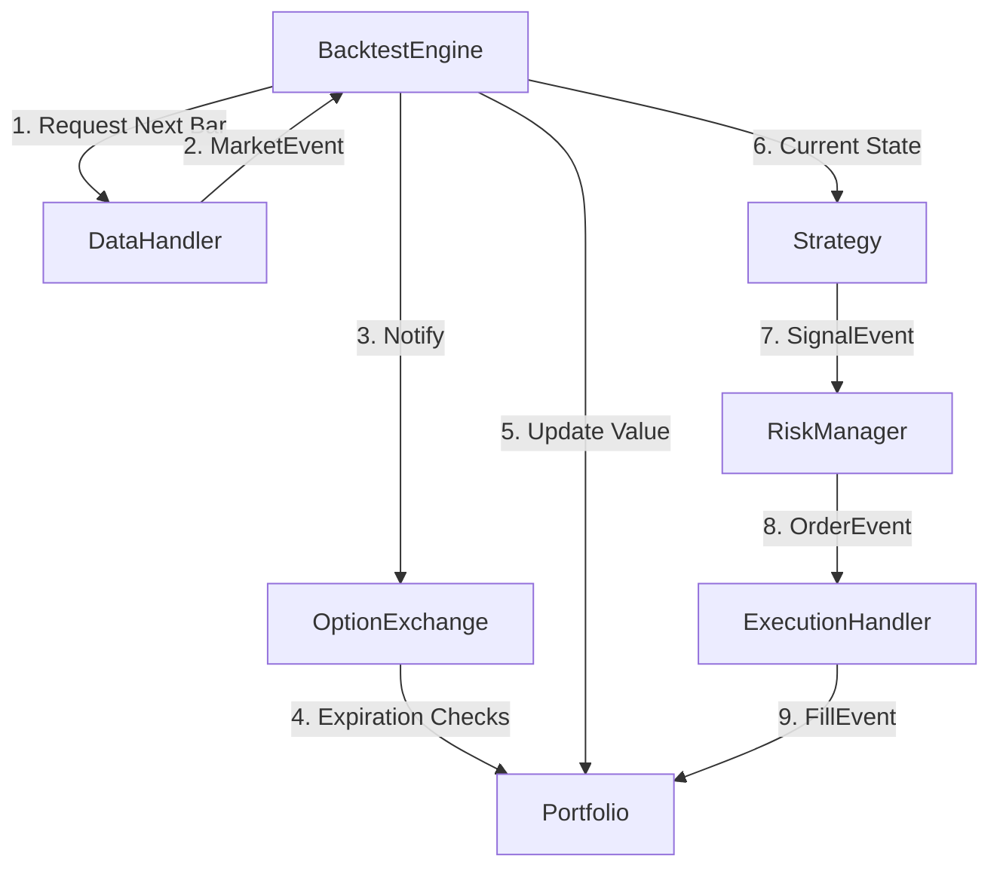

# Option Backtesting Engine Architecture

## 1. System Overview
This repository implements an **Event-Driven Architecture** designed specifically for the complexities of US Equity Options. Unlike simple stock backtesters, this system explicitly handles:
* **Non-Linear Payoffs:** Dedicated `OptionPosition` classes for tracking Greeks and PnL.
* **Contract Lifecycles:** Automated handling of Expiration, Assignment, and Exercise via an `OptionExchange` component.
* **Data Volume:** Iterator-based data loading to handle massive option chain CSVs without memory overflows.

### High-Level Data Flow
The system follows a cyclic event loop orchestrated by the `BacktestEngine`.



---

## 2. Core Components

### A. The Data Layer (`src/data`)
*Responsible for efficiently feeding market data to the system.*

#### `DataHandler` (Abstract Base Class)
* **Role:** The single source of truth for market prices.
* **Key Feature:** Uses Python **Generators** (`yield`) to load data chunk-by-chunk, avoiding the $O(N)$ filtering cost of loading 5 years of option chains into memory.
* **Subclasses:**
    * `HistoricCSVDataHandler`: Reads formatted CSVs from disk.
    * `LiveApiDataHandler` (Future): Connects to IBKR/TDA APIs.
* **Key Methods:**
    * `get_latest_bar(symbol)`: Returns the most recent OHLC/Bid-Ask.
    * `get_option_chain(symbol, expiry)`: Returns the specific slice of the chain for the current timestamp.

---

### B. The State Layer (`src/portfolio`)
*Responsible for tracking "What we own" and "What it's worth".*

#### `Position` (Base Class)
* **Role:** Stores atomic assets.
* **Attributes:** `symbol`, `quantity`, `avg_price`, `market_value`.

#### `OptionPosition` (Inherits from Position)
* **Role:** Adds option-specific physics.
* **Attributes:**
    * `strike`, `expiry`, `option_type` (CALL/PUT)
    * `multiplier` (Standard: 100)
    * `greeks`: Dictionary `{delta, gamma, theta, vega}`
* **Methods:**
    * `is_itm(underlying_price)`: Returns `bool`.
    * `update_greeks(model)`: Recalculates risk metrics based on current market data.

#### `Portfolio`
* **Role:** Aggregates positions and manages cash.
* **Key Improvement:** Replaces legacy dictionary structures with a list of `Position` objects.
* **Methods:**
    * `mark_to_market(data_handler)`: Updates the equity of all positions using the latest `DataHandler` prices.
    * `on_fill(fill_event)`: Adjusts cash and adds/removes positions.

---

### C. The Execution Layer (`src/execution`)
*Responsible for simulating the mechanics of the market.*

#### `ExecutionHandler`
* **Role:** Simulates the Broker. Decides *if* and *at what price* a trade occurs.
* **Logic:** Can implement different slippage models (e.g., `MidpointFill`, `BidAskFill`, `PessimisticFill`).

#### `OptionExchange`
* **Role:** Simulates the Exchange/Clearing House.
* **Responsibility:** Handles the lifecycle events that happen *without* a user order.
* **Key Logic:** `check_expiration(portfolio)`
    * Runs every time step.
    * Checks if `current_date >= position.expiry`.
    * If ITM: Generates an "Exercise" or "Assignment" trade automatically.
    * If OTM: Expires the option worthless.

---

### D. The Logic Layer (`src/strategy`)
*Responsible for trading decisions.*

#### `Strategy` (Abstract Base Class)
* **Role:** User-defined logic.
* **Input:** `MarketEvent` (Data) + `Portfolio` (State).
* **Output:** `SignalEvent` (Desire to trade).

#### `RiskManager`
* **Role:** Gatekeeper for the Strategy.
* **Methods:**
    * `validate_order(order)`: Checks if the order violates margin requirements or concentration limits.
    * `allocate_size(signal)`: Converts a raw signal (e.g., "Buy SPY") into a concrete quantity based on account size.

---

## 3. Directory Structure

```text
project_root/
├── data/                   # CSV files
├── src/
│   ├── __init__.py
│   ├── engine.py           # The Event Loop (formerly Chronos)
│   ├── events.py           # Event Class Definitions (Market, Signal, Order, Fill)
│   ├── data/
│   │   ├── handler.py
│   │   └── loader.py
│   ├── strategy/
│   │   ├── base.py
│   │   └── moving_average.py
│   ├── portfolio/
│   │   ├── portfolio.py
│   │   ├── position.py     # Contains OptionPosition class
│   │   └── risk.py
│   └── execution/
│       ├── handler.py
│       └── exchange.py     # Expiration logic
├── tests/                  # Pytest suite
├── config.yaml             # Backtest parameters
├── main.py                 # Entry point
└── ARCHITECTURE.md         # This file
```
